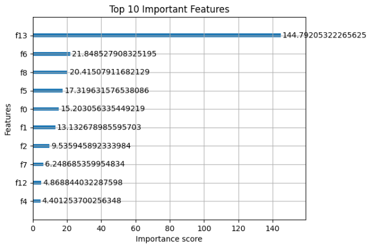

# Loan Default Prediction & Credit Risk Analysis


## 📄 Project Overview
This project develops a machine learning pipeline to predict loan default risk, helping financial institutions make data-driven lending decisions while minimizing losses.  
It compares multiple models, performs threshold tuning, and explains feature importance to deliver actionable insights.

---

## 📊 Dataset
- **Source:** [Insert Dataset Link if public, or state “Proprietary/Simulated”]
- **Size:** ~84,000 records
- **Features:** Numerical variables such as DebtRatio, MonthlyIncome, RevolvingUtilizationOfUnsecuredLines, etc.
- **Target:** Binary classification — Default (1) / No Default (0)

---

## 🛠 Methodology
The project workflow includes:
1. **Data Exploration**
   - Dataset overview
   - Missing value analysis
   - Exploratory Data Analysis (EDA)
2. **Data Preprocessing & Feature Engineering**
   - Missing value imputation using SimpleImputer
   - Creation of derived features
3. **Model Building**
   - Logistic Regression
   - Random Forest (hyperparameter tuning)
   - XGBoost (hyperparameter tuning)
4. **Model Evaluation**
   - Precision, Recall, F1-score, Accuracy, ROC-AUC
   - Performance comparison
5. **Threshold Tuning**
   - Adjusting decision threshold to prioritize recall
6. **Feature Importance Analysis**
   - Understanding key drivers of default risk

---

## 📈 Key Results

| Model                  | Precision | Recall | F1-Score | ROC-AUC |
|------------------------|-----------|--------|----------|---------:|
| Logistic Regression    | 0.73      | 0.66   | 0.69     | 0.7070   |
| Random Forest         | 0.87      | 0.83   | 0.85     | 0.8532   |
| **XGBoost (Tuned)**   | **0.97**  | **0.92** | **0.94** | **0.9442** |

**Best Model:** Tuned XGBoost with decision threshold = 0.3.

**Key Features Driving Default Risk:**  
- DebtRatio  
- RevolvingUtilizationOfUnsecuredLines  
- MonthlyIncome  
- NumberOfOpenCreditLinesAndLoans  
- Age  

---

## 📊 Visual Results
**ROC-AUC Comparison:**


**Feature Importance:**


---

## 💡 Business Impact
- **Proactive Risk Management:** Identify high-risk borrowers before issuing loans.  
- **Minimize Losses:** Reduce defaults through targeted lending decisions.  
- **Better Decision-Making:** Prioritize recall to ensure risky borrowers are not overlooked.

---

## ⚙️ How to Use
1. Clone the repository:
```bash
git clone https://github.com/yourusername/Credit-Risk-Analysis.git
cd Credit-Risk-Analysis
